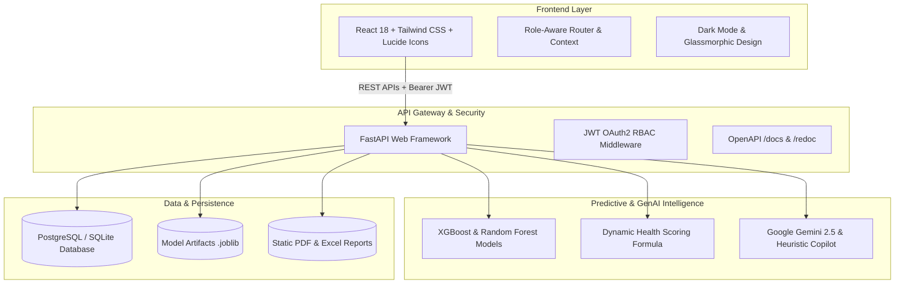

# AI-Driven Project Management & Progress Monitoring Platform (AI-PMP)

> **An industry-grade, intelligent enterprise platform combining machine learning delay prediction, real-time health scoring, GenAI project copilots, and multi-role oversight for engineering squads, project managers, and evaluators.**

---

## 🌟 Executive Summary

Traditional project management tools (Jira, Asana, Trello) are purely descriptive: they report what tasks are done, but fail to forecast *when* and *why* a project will slip schedule until it is already too late.

**AI-PMP** solves this by embedding predictive intelligence into every layer of software project delivery:
1. **Predictive Delay Engine**: Trained Random Forest and XGBoost algorithms ($R^2 = 0.955$) evaluate daily task counts, completion velocity, team allocation, and blocker frequencies to forecast exact schedule slippage days in advance.
2. **Project Health Score**: Continuous formula balancing delay penalties, blocker severity, and resource strain to maintain an objective 0-100 delivery health rating.
3. **Automated Risk Detector**: Auto-detects blockers, schedule bottlenecks, and developer overload from daily standup logs.
4. **GenAI Project Assistant**: Natural language copilot powered by Google Gemini and an intelligent context-aware reasoning engine to explain bottlenecks and suggest concrete mitigations.
5. **Multi-Role Experience**: Tailored interfaces for **Admin**, **Project Manager**, **Team Lead**, **Developer**, and **Client / Teacher** with real-time multi-project oversight.

---

## 🏗️ Architecture & Technology Stack



- **Frontend**: React 18, Vite, Tailwind CSS, Lucide Icons, Glassmorphic Design, Custom Charts
- **Backend**: FastAPI (Python 3.11), Pydantic v2, SQLAlchemy 2.0
- **Database**: PostgreSQL 16 (with SQLite zero-config fallback for instant local testing)
- **Machine Learning**: Scikit-Learn, XGBoost, Pandas, NumPy, Joblib
- **GenAI / LLM**: Google Gemini API (`google-genai` SDK) with heuristic fallback engine
- **Reporting**: ReportLab (PDF export) & OpenPyXL (Excel export)
- **DevOps**: Docker, Docker Compose, GitHub Actions CI/CD, Render, AWS ECS Fargate

---

## 👥 Supported User Roles & Permissions

| Role | Primary Functions |
| :--- | :--- |
| **Admin** | System configuration, create/delete projects, manage all users, global telemetry. |
| **Project Manager** | Create projects, assign tasks to developers, review daily standups, export reports. |
| **Team Lead** | Break down features, manage sprint backlog, approve QA tickets, review team velocity. |
| **Developer** | View personal task queues, drag Kanban cards, log daily standups with blockers. |
| **Client / Teacher** | Read-only bird's-eye monitoring of all student and client projects with real-time health metrics. |

---

## 🚀 Quick Start (Local Development)

### 1. Prerequisites
- Python 3.11+
- Node.js 18+ (or Docker)

### 2. Backend & ML Setup
```bash
# Clone and enter directory
cd "AI-Driven Project Management and Progress Monitoring Platform"

# Setup virtual environment
python -m venv .venv
# On Windows:
.\.venv\Scripts\activate
# On Linux/macOS:
source .venv/bin/activate

# Install dependencies
pip install -r backend/requirements.txt

# Initialize database schema and inject rich demo seeds
python backend/app/db/init_db.py

# Train / evaluate predictive ML models (Random Forest & XGBoost)
python ml_models/train_delay_model.py
python ml_models/evaluate_model.py

# Run backend API server
python backend/run.py
```
Backend will be live at `http://localhost:8000` with Swagger documentation at `http://localhost:8000/docs`.

### 3. Frontend Setup
```bash
cd frontend
npm install
npm run dev
```
Frontend will be live at `http://localhost:5173`.

---

## 🐳 Docker Deployment (1-Command Orchestration)

To spin up the complete production stack (PostgreSQL, FastAPI Backend, React Frontend Nginx):
```bash
docker compose up --build
```
- **Web Application**: `http://localhost:3000`
- **FastAPI API & Docs**: `http://localhost:8000/docs`
- **PostgreSQL Database**: `localhost:5432` (user: `postgres`, db: `ai_pmp`)

---

## 🔑 Default Demo Credentials

You can use the **1-Click Quick Login Persona Switcher** on the login page or enter credentials manually:

| Role | Email | Password |
| :--- | :--- | :--- |
| **Admin** | `admin@aipmp.io` | `password123` |
| **Project Manager** | `pm@aipmp.io` | `password123` |
| **Team Lead** | `lead@aipmp.io` | `password123` |
| **Developer** | `dev@aipmp.io` | `password123` |
| **Teacher / Client** | `teacher@aipmp.io` | `password123` |

---

## 🧪 Automated Testing

Run the comprehensive unit and integration test suite:
```bash
.\.venv\Scripts\pytest.exe tests/ -v
```
**Results**: `15 passed` covering Authentication, Project CRUD, Kanban Status Transitions, Daily Standup Sync, ML Delay Prediction, AI Copilot, and Executive Dashboards.

---

## 📂 Project Structure

```
├── backend/                  # FastAPI backend application
│   ├── app/
│   │   ├── api/v1/          # Endpoints (auth, projects, tasks, updates, ai, reports, chat)
│   │   ├── core/            # Config, security, JWT, database connection
│   │   ├── db/              # init_db.py table creator and seed data
│   │   ├── models/          # SQLAlchemy ORM models (11 tables)
│   │   ├── schemas/         # Pydantic v2 validation schemas
│   │   └── services/        # AI service, GenAI, ReportLab PDF, OpenPyXL Excel
│   ├── requirements.txt     # Python package requirements
│   └── run.py               # Uvicorn server runner
├── frontend/                 # React + Tailwind + Vite modern SPA
│   ├── src/
│   │   ├── components/      # Navbar, Sidebar, MetricCard, HealthBadge, Kanban, Gantt, Chat
│   │   ├── context/         # AuthContext with 1-click persona switcher
│   │   ├── pages/           # Dashboard, Projects, Tasks, DailyUpdates, Analytics, AI, Reports
│   │   └── services/        # api.js client with mockData fallback
├── ml_models/                # Predictive ML pipeline
│   ├── artifacts/           # Trained XGBoost & Random Forest model weights (.joblib)
│   ├── dataset_generator.py # Synthetic dataset generator
│   ├── train_delay_model.py # Training & comparison script
│   ├── evaluate_model.py    # Metric evaluation script
│   └── predictor.py         # Modular production predictor pipeline
├── database/                 # Relational schema, ER diagram, and seed SQL
├── docker/                   # Dockerfile.backend, Dockerfile.frontend, nginx.conf
├── deploy/                   # Render.yaml, AWS ECS Task Definition
├── docs/                     # Full technical documentation
└── tests/                    # Pytest test suite
```

---

## 📄 License
MIT License. Built for enterprise software organizations, academic teams, and delivery stakeholders.
