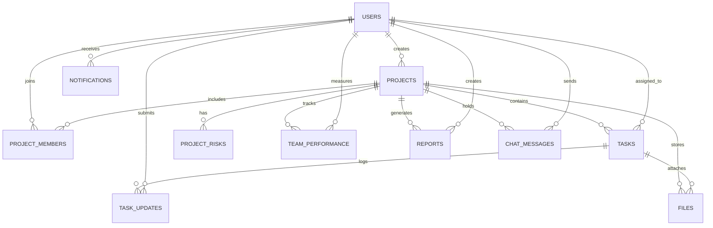

# Entity Relationship & Database Architecture

The **AI-Driven Project Management and Progress Monitoring Platform** uses a normalized relational architecture (3NF) designed for high performance, ACID compliance, and low-latency transactional analytics.

---

## 1. Visual Entity-Relationship Diagram

---

## 2. Table Specifications & Relationships

### `users`
- **Primary Key**: `id`
- **Indices**: `email` (Unique, B-Tree), `role`
- **Roles**: `ADMIN`, `PROJECT_MANAGER`, `TEAM_LEAD`, `DEVELOPER`, `CLIENT_TEACHER`
- **Security**: Argon2/Bcrypt hash stored in `hashed_password`.

### `projects`
- **Primary Key**: `id`
- **Foreign Keys**: `created_by_id` -> `users(id)` ON DELETE SET NULL
- **Indices**: `status`, `created_by_id`, `deadline`
- **Key Metrics**: `health_score` (0-100 float), `predicted_delay_days` (ML inference target), `delay_risk_level` (`LOW`, `MEDIUM`, `HIGH`).

### `project_members`
- **Primary Key**: `id`
- **Foreign Keys**: `project_id` -> `projects(id)` ON DELETE CASCADE, `user_id` -> `users(id)` ON DELETE CASCADE
- **Unique Constraint**: `(project_id, user_id)`

### `tasks`
- **Primary Key**: `id`
- **Foreign Keys**: `project_id` -> `projects(id)` ON DELETE CASCADE, `assigned_to_id` -> `users(id)` ON DELETE SET NULL
- **Status States**: `TODO`, `IN_PROGRESS`, `IN_REVIEW`, `COMPLETED`, `BLOCKED`
- **Priority**: `LOW`, `MEDIUM`, `HIGH`, `URGENT`
- **Risk Indicators**: `is_at_risk` boolean flag populated automatically by the ML engine.

### `task_updates`
- **Primary Key**: `id`
- **Foreign Keys**: `task_id` -> `tasks(id)` ON DELETE CASCADE, `user_id` -> `users(id)` ON DELETE CASCADE
- **Attributes**: `yesterday_work`, `today_plan`, `blockers`, `progress_percentage`, `hours_spent`

### `project_risks`
- **Primary Key**: `id`
- **Foreign Keys**: `project_id` -> `projects(id)` ON DELETE CASCADE
- **Attributes**: `risk_type` (`SCHEDULE`, `RESOURCE`, `TECHNICAL`, `BUDGET`), `severity` (`LOW`, `MEDIUM`, `HIGH`, `CRITICAL`), `description`, `suggested_mitigation`, `detected_by_ai`

### `team_performance`
- **Primary Key**: `id`
- **Foreign Keys**: `project_id` -> `projects(id)` ON DELETE CASCADE, `user_id` -> `users(id)` ON DELETE CASCADE
- **Composite Unique**: `(project_id, user_id, recorded_date)`
- **Metrics**: `tasks_completed`, `average_completion_time_hrs`, `productivity_score`, `on_time_delivery_rate`

### `reports`
- **Primary Key**: `id`
- **Foreign Keys**: `project_id` -> `projects(id)` ON DELETE CASCADE, `generated_by_id` -> `users(id)` ON DELETE SET NULL
- **Attributes**: `report_type` (`WEEKLY`, `MONTHLY`), `summary`, `metrics_json`, `recommendations`, `pdf_filename`, `excel_filename`

### `notifications`
- **Primary Key**: `id`
- **Foreign Keys**: `user_id` -> `users(id)` ON DELETE CASCADE
- **Attributes**: `type` (`EMAIL`, `DUE_DATE`, `RISK`, `UPDATE`), `is_read`, `action_url`

### `files` & `chat_messages`
- Store attachments, team collaboration messages, and references to project deliverables.
