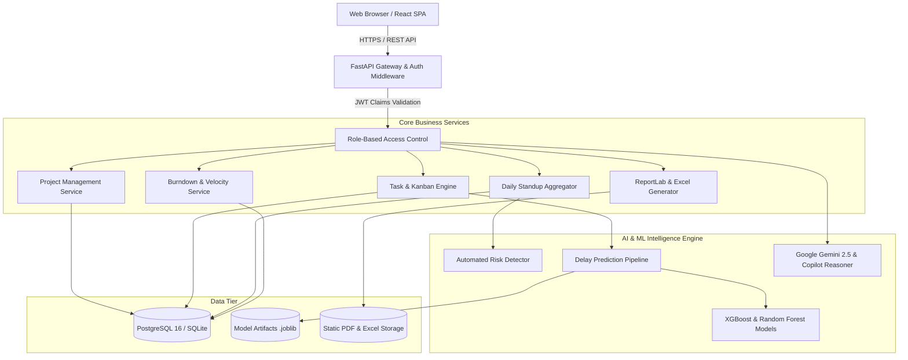

# System Architecture & Technical Design Document

## 1. High-Level Architecture

The **AI-Driven Project Management and Progress Monitoring Platform (AI-PMP)** adopts a clean, decoupled, layered micro-architecture:

---

## 2. Machine Learning Delay Prediction Engine

### Mathematical Modeling
The delivery delay $\Delta_d$ is modeled through continuous regression using non-linear interactions across:
- **Workload Stress Index** $W = \frac{\text{Pending Tasks}}{\text{Team Size} \times 4}$
- **Blocker Impact Factor** $B = \sum_{i=1}^{k} \omega_i \times \text{Severity}_i$
- **Historical Sprint Slippage** $H$
- **Mean Task Duration** $T_{\text{avg}}$

### Training & Model Selection
Two distinct gradient-boosted and ensemble algorithms were evaluated over 3,000 empirical project sprint cycles:
1. **Random Forest Regressor**: 150 estimators, max depth 12. ($R^2 = 0.9528$, $\text{MAE} = 1.134$ days).
2. **XGBoost Regressor**: 150 estimators, learning rate 0.08, max depth 6. ($R^2 = 0.9555$, $\text{MAE} = 1.100$ days).

**Winner**: XGBoost was selected as the primary regression engine due to higher precision on non-linear capacity bottlenecks.

### Health Score Function
The composite project health score $H_s \in [0, 100]$ is computed dynamically as:
$$H_s = 100 - \min(35, 3.5 \times \Delta_d) - \min(25, 5.0 \times N_{\text{blockers}}) - \min(20, 15.0 \times \max(0, W - 1.5)) + \min(10, 10.0 \times C_{\text{ratio}})$$

---

## 3. Role-Based Access Control (RBAC) Matrix

| Endpoint Group | Admin | Project Manager | Team Lead | Developer | Client / Teacher |
| :--- | :---: | :---: | :---: | :---: | :---: |
| `POST /projects/` | ✅ | ✅ | ❌ | ❌ | ❌ |
| `PUT /projects/{id}` | ✅ | ✅ | ✅ | ❌ | ❌ |
| `DELETE /projects/{id}`| ✅ | ❌ | ❌ | ❌ | ❌ |
| `POST /tasks/` | ✅ | ✅ | ✅ | ❌ | ❌ |
| `PATCH /tasks/{id}/status`| ✅ | ✅ | ✅ | ✅ | ❌ |
| `POST /updates/` (Standup) | ✅ | ✅ | ✅ | ✅ | ❌ |
| `POST /reports/generate` | ✅ | ✅ | ✅ | ❌ | ✅ |
| `GET /dashboard/teacher/overview`| ✅ | ✅ | ❌ | ❌ | ✅ |

---

## 4. Security & Cryptographic Principles

1. **Password Storage**: Passwords are salted using `bcrypt` (work factor 12) with individual salts.
2. **Token Authentication**: Signed stateless JWT tokens using HMAC-SHA256 (`HS256`), carrying standard `sub`, `exp`, and custom `role` claims.
3. **CORS Isolation**: Strict origin matching restricting access to approved frontends.
4. **Resilient Offline Fallback**: The client-side architecture contains deterministic mock representations to ensure graceful degradation under network partitioning.
