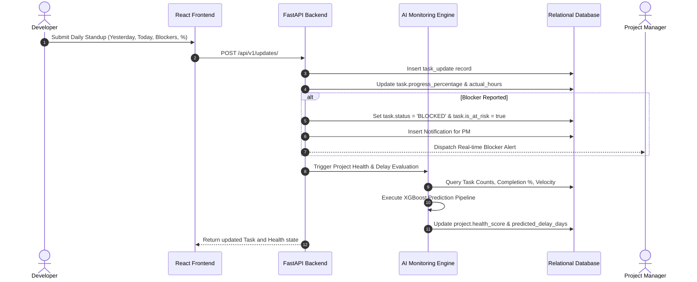
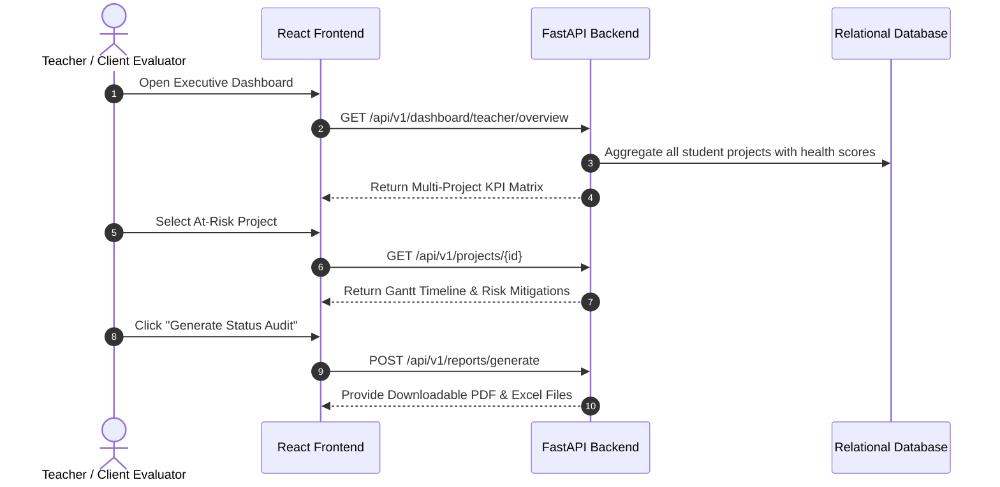
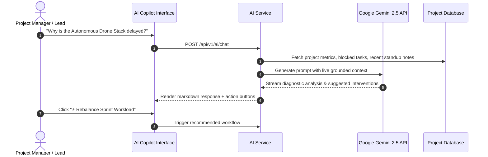

# Platform Workflow Sequences

This document illustrates the operational lifecycles for daily standups, AI delay predictions, and evaluator oversight.

---

## 1. Daily Developer Standup & Progress Synchronization Flow

---

## 2. Real-Time Teacher / Client Oversight Flow

---

## 3. GenAI Copilot Interaction Sequence

